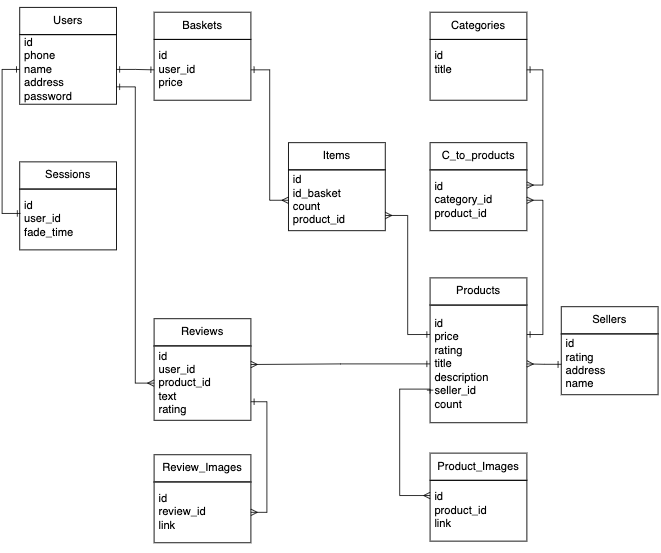
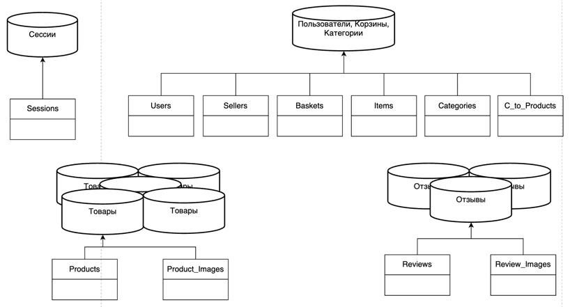
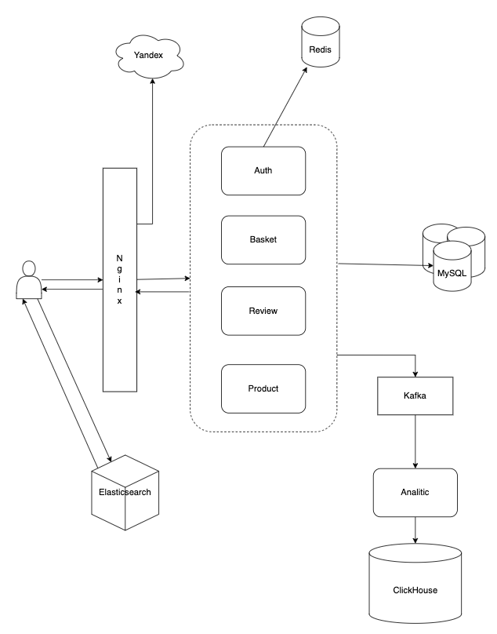

# Ozon

## 1. Тема и целевая аудитория
### 1.1. Тема
[Ozon](https://www.ozon.ru/) - интернет-магазин, сервис для покупки товаров.
### 1.2. Целевая аудитория
За ноябрь 2021 года насчитывает 157 млн посетителей сайта в месяц [[1]](https://www.similarweb.com/website/ozon.ru/) 
или 5 млн посетителей в день.

Можно выделить 3 сегмента стран которые, чаще других посещают Ozon [[2]](https://www.similarweb.com/website/ozon.ru/), 
однако основная масса сосредоточена в России.
* Россия - 93.97%
* Страны Европы - 5%
* США - 0.34%

Возрастная категория: 18-45 лет

### 1.3. MVP
* регистрация и авторизация
* поиск товара по поисковой строке
* фильтрация товаров по категориям
* просмотр списка товаров (39 товаров на одной странице)
* просмотр товара + отзывов (загружается 10 отзывов по умолчанию)
* работа с корзиной (добавление, удаление)
* заказ товара
* написание отзыва

## 2. Расчет нагрузки
### 2.1. Продуктовые метрики

#### 2.1.1. Дневная аудитория
Ежедневно страницу Ozon открывают **5 млн** раз, по итогу ноября 2021 года.
Точных данных о количестве пользователей в день нет, поэтому используя число в 5 млн оценочно расчитаем это число.
Возьмем коэфициент 0.75, получаем `5млн * 0.75 = 3.75млн` уникальных пользователей в день.

#### 2.1.2. Среднее количество действий пользователя
Средняя продолжительность сессии одного пользователя 9 мин. 
За это время пользователь в среднем посещает 11 страниц [[3]](https://www.similarweb.com/website/ozon.ru/)

Используя личный опыт и опыт знакомых, был составлен сценарий стандартного поведения пользователя на сайте.
Стоит отметить что оценко является досточно субъективной,
и количество посещения разных страниц может сильно различаться в зависимости от пользовательского сценария.

* регистрация или авторизация: 0-1 раз (0.5)
* поиск товара по поисковой строке: 2-5 раз (3.5)
* просмотр списка товаров и изменение категорий: 2-5 * 3 раз (10.5)
* просмотр страницы товара: 4-12 раз (8)
* добавление в корзину: 0-4 раз (2)
* удаление из корзины: 0-2 раз (1)
* заказ товара: 0-1 раз (0.5)
* написание отзыва: 0-1 раз (0.5)

### 2.2. Технические метрики
Необходимо учесть, что трафик неравномерно расспределяется по суткам.
Учитывая, что абсолютное большенство аудитории находится в России, а именно в евромейской ее части,
в расчетах на сетевой трафик и RPS нужно домножать на коэфициент 2.

#### 2.2.1. Общий объем изображений товаров
Ozon торгует более 9 млн товарных наименованй [[4]](https://ru.wikipedia.org/wiki/Ozon).
Каждый товар содержит в среднем 4 фотографии, при этом каждое изображение весит в среднем 50 KB.
Отсюда получаем `50 * 4 * 9000000 = 1.67 Тб`.

#### 2.2.2. Общий объем изображений в отзывах товара
* Предположим что из 9 млн, есть 1 млн наиболее активных товаров, у которых среднее количество отзывов 20.
  Учитывая, что к большинству отзывов не прикреплено никакое изображение, 
  а к оставшимся прикреплено гораздо больше картинок, чем одна, 
  возьмем, что в среднем количество изображений прикрепленных к отзыву 1, кторое весит 50 KB.
  Отсюда получаем `1000000 * 20 * 50 = 0.93 Тб`
  
* У оставшихся 8 млн в среднем по 2 отзыва,
  также возьмем в среднем, что к одному отзыву прикреплена 1 изображение.
  Отсюда получаем `8000000 * 1 * 50 = 0.37 Тб`

#### 2.2.2. Сетевой трафик
Основным типом трафика является получение информации о товарах. 
Можно выделить две наиболее посещаемые страницы: детальная страница товара, каталог товаров.

* Детальная страница товара

  Как уже было сказанно выше каждый товар в среднем содержит 4 фотографии по 50 KB, 
  при загрузке страницы также прогружаются отзывы (максимум 10 штук).
  Рассматривая, что в большинстве запросов учавствует 1 млн наиболее активных товаров,
  необходимо еще загрузить 10 изображений по 50 KB.
  То есть в среднем объем трафика составляет 700 KB.
  `700 * 8 * 5000000 * 2 / 24 / 3600 = 632 MB/s`.
  
* Каталог товаров

  При просмотре списка товаров, необходимо загрузить 39 изображений товаров,
  однако вес одного изображения составляет 40 KB, так как это лишь превью фото и нет необходимости загружать полностью.
  Получаем 1560 KB которые надо загрузить, учитывая трафик, получаем:
  `1560 * 10.5 * 5000000 * 2 / 24 / 3600 = 1852 MB/s`
  
#### 2.2.3. Расчет RPS
Пользователь сайта в среднем совершает 27 операций. Получаем: 
`RPS = 27 * 5000000 * 2 = 3126`.

Запросы на чтение:
* поиск товара по поисковой строке: **404 RPS**
* просмотр списка товаров и изменение категорий: **1216 RPS**
* просмотр страницы товара: **926 RPS**

Запросы на запись:
* регистрация или авторизация: **58 RPS**
* работа с корзиной (добавление, удаление): **348 RPS**
* заказ товара: **58 RPS**
* написание отзыва: **58 RPS**

## 3. Логическая схема

## 4. Физическая схема

### 4.1. Объем текстовых данных
* **Товары** \
  Как уже говорилось ранее, на Ozon **9 млн** уникальных товаров. \
  Для каждого мы храним id (4б), название (15б), цена (4б), рейтинг (4б),
  описание (126б), id продавца (4б), количество товаров (4б) \
  `Итого 4 + 15 + 4 + 4 + 126 + 4 + 4 = 161 байт`
  
* **Пользователи** \
  Открытой информации о количество зарегестрированных пользователей на Ozon нет,
  но есть данная информация про Wildberries.
  Количество зарегистрированных пользователей 41 млн.
  Так как Ozon является меньше Wildberries, уменьшим это число до **30 млн**. \
  Для каждого пользователя мы храним id (4б), номер телефона (12б), имя (15б),
  адресс пользователя (15б), пароль (50б) \
  `Итого 4 + 12 + 15 + 50 = 81 байт`
  
* **Корзина** \
  Учитывая, что у каждого пользователя есть только одна корзина, количество корзин **20 млн** \
  Для каждой корзины мы храним id (4б), id пользователя (4б), итоговая цена (4б) \
  `Итог 4 + 4 + 4 = 12 байт`
  
* **Единицы товара в корзине** \
  Будем рассматривать максимальное количество единиц товаров в корзине, которое может одновременно хранится в таблице.
  Возьмем, что в среднем пользователь покупает в одном заказе 2 товара, получаем **60 млн** единиц. \
  Для хранения необходимо: id (4б), id корзины (4б), количество единиц товара (4б), id товара (4б) \
  `Итог 4 + 4 + 4 + 4 = 16 байт`
  
* **Отзывы** \
  По описанным выше расчетам, мы получаем, что на Озоне сейчас **28 млн** отзывов \
  Для хранения необходимо: id (4б), id пользователя (4б), id товара (4б), текст отзыва (126б), рейтинг отзыва (4б) \
  `Итог 4 + 4 + 4 + 126 + 4 = 142 байта`
  
* **Таблицы с сылками на картинки**
  Из расчетов выше **28 млн** картинок, а следовательно и ссылок на них необходимо хранить для отзывов.
  И 9 * 4 = **36 млн** картинок и ссылок необходимо хранить для самих товаров. \
  Для хранения необходимо: id (4б), ссылка на изображение (20б), id товара (отзыва) (4б) \
  `Итог 4 + 20 + 4 = 28 байт`

| Таблица       | Размер одной строки | Количество строк  | Вес таблицы | 
|---------------|:-------------------:|:-----------------:|:-----------:|
| Товар         |      161 байт       |     9.000.000     |    2Гб      | 
| Пользователь  |      81 байта       |    30.000.000     |    3Гб      | 
| Корзина       |      12 байта       |    30.000.000     |    0.5Гб    | 
| Единицы товара|       16 байт       |    60.000.000     |    1Гб      | 
| Отзыв         |      142 байт       |    28.000.000     |    4Гб      | 
| "Картинки"    |      28 байт        |    28.000.000     |    0.7Гб    | 

Итого **12Гб текстовой информации** \
Текстовой информации хранится не так много, следовательно дополнительные механизмы шардирования можно не делать.

### 4.2. Нагрузка на базу данных
Самыми сложными запросами являются на выборку списка товаров и конкретного товара \
* запрос на выборку списка товаров: 1216 RPS
* запрос на выборку конкретного товара: 926 RPS

Любая база данных может держать ограниченную нагрузку чтение, возьмем среднее значение этой нагрузки в 500 RPS.
Исходя из этого можно сделать вывод, что для таблиц которые нужны для выборки товаров необходимо сделать репликации.
Для таблиц, учавствующих в выборке списко товаров (Products, Product_Images) 3 реплики,
для таблиц, учавствующих в выборке конкретного товара (Products, Product_Images, Reviews, Review_Images) 2 реплики.

### 4.3. Физическая схема

## 5. Выбор технологий

### 5.1. Бэкенд
Для бэкеннда будем использовать язык программированя Golang, 
так как этот язык обладает наиболее необходимыми характеристиками, а именно:
* производительсность (является самым важным пунктом, были отброшены из рассмотрения интерпретируемые языки)
* удобство и простота написания (именно из за этого пункта был отброшен язык C++)
* дешовая многопоточность из коробки (отброшен язык Java)
* достаточно просто писать микросервисную архитектуру

### 5.2. Фронтенд
Для фронтенда взят стандартный набор технологий: HTML, CSS, TypeScript.
Для написания скриптов не был выбран JavaScript в первую очередь из за того, 
что TypeScript является языком со статической типизацией, что позволяет избегать множества багов.
Приложение будет использовать давно зарекомендованную технологию SPA и фреймворк React.

### 5.3. База данных
* **Хранения текстовой информации** \
  Для хранения текстовой информации сразу сужаем область поиска, до реляционных баз данных,
  по причине того, что составленная модель бд идеально на нее наложится.
  Далее выбор встает между такими наиболее популярными решениями, как MySQl, PostgreSQL.
  Была выбрана **MySQL** по причине легкости, скорости запросов на чтение, производительности. 
  На текущих объемах памяти и нагрузки, использование PostgreSQL и его оптимизаций является излишним.
  
* **Хранение картинок** \
  Для хранения картинок необходимо облачное хранилище.
  Было выбрано **Yandex Cloud**, рассматриволся также Amazon S3, 
  однако он не был выбран по той причине, что у амазона нет дата центров в России, 
  а следоватеально картинка до пользователя будет доставляться чуть дольше.
  У яндекса также есть дата центр в Финляндии, что позволяет не забывать о пользователях из США.
  
* **Key-Value** \
  При разработке сложных веб сервисов уже сложно обойтись без использования key-value хранилищь.
  В данном проекте данное хранилище необходимо будет для хранения сессий пользователей.
  Выберем **Redis** за высокую производительность, простоту использования и открытый исходный код.

* **Хранение аналитики** \
  Для благоприятного роста и развития проекта нельзя забывать про сбор аналитики.
  В качестве хранилища для аналитических данных возьмем **ClickHouse** как современное
  и хорошо зарекомендованное решение, также ClickHouse напорядок быстрее Vertica и Hadoop.

### 5.4. Балансировщик нагрузки
В качестве балансировщика выберем **Nginx** как наиболее популярную и известную технологию.
Также Nginx более быстрый и меньше потребляет памяти в сравлении с Apache, как второго наиболее популярного решения [[5]](https://github.com/Sergei39/TP-homework-AlandSD)
Nginx будет использоваться для следующих целей:
* Отдача статики
* Балансировщик нагрузи

Для балансировки нагрузки будем использовать подход

### 5.5. Поисковый движок
В проекте предусмотрен поиск товаров, поэтому следует также выбрать поисковый движок.
Рассматривались два наиболее популярных решения: Elasticsearch и Sphinx.
В итоге был выбран первый вариант - Elasticsearch, главная причина это масштабируемость из коробки.

### 5.6. Очередь
Для выполнения асинхронных задач (сбора аналитики), необходим сервер очерди.
Была выбрана **Kafka** по той причине что она является стриминговой, 
то есть идеально подойдет для сбора аналитики. Также Kafka хорошо шардируется горизонтально.

## 6. Архитектура
### 6.1. Анализ архитектуры
Была выбранна микросервисная архитектура по следующим причинам:
* Масштабируемость
* Гибкость
* Простота деплоя

Выделим несколько микросервисов:
* микросервис авторизации
* микросервис работы с корзиной
* микросервис работы с отзывами и оценками
* микросервис работы с товарами
* микросервис сбора аналитики

### 6.2. Итоговая схема

